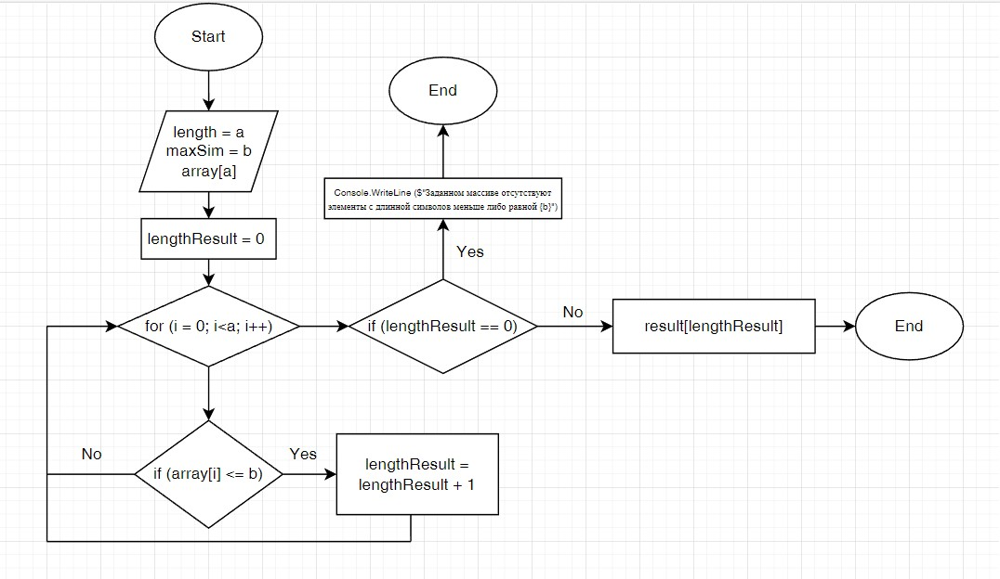

# Описание решения поставленной задачи

1. Ввод изначального массива реализован путем запроса его параметров у пользователя, а именно: его длина и элементы;
2. Максимальное количество символов в будущем массиве так же определяется пользователем (согласно условиям задачи, максимальное число элементов равно трём);
3. Исходный масиив выводится в консоль;
4. Далее был создан метод "GetSizeArray" для опредения кол-ва элементов в исходном массиве, которые соотвестсуют условиям задачи. 
5. Метод "GetSizeArray" после своей реализации возвращает число искомых элементов.
* Если "GetSizeArray" возвращает "0" - программа сообщает об отсуствии искомых элементов в массиве и завершает свою работу;
* Если возвращенное число больше "0" - создается новый массив с длиной элементов, полученных в результате работы вышеуказанного метода;
6. Методом "GetNewArray" новый массив заполняется элементами, число символов которых меньше или равное числу заданному пользователем;
7. В консоль выводится результирующий массив и программа завершает свою работу;
***

*Методы "GetSizeArray" и "GetNewArray" можно объединить, но в этом случае будет усложнена реализация проверки исключений, мной было принято решение о разделении этих двух методов*

# Блок-схема

Ниже представлена краткая блок-схема работы программы. Элементы исходного и результирующего массива не фигурируют в блок-схеме, т.к. задаются пользователем с клавиатуры.

